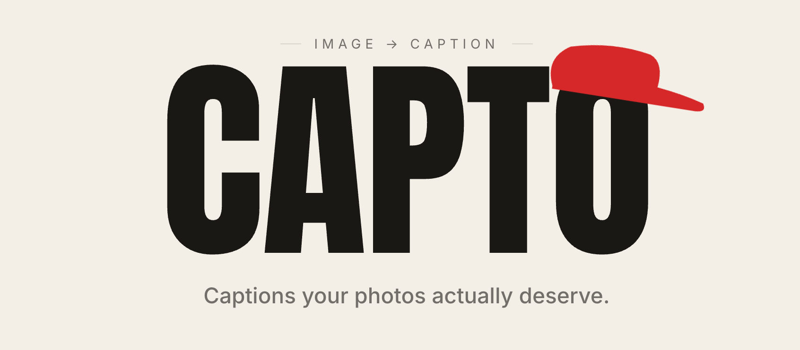

<p align="center">
  
</p>

# Capto

Drop in a photo, pick a tone, and Capto returns a social-media-ready caption. Built around a vision-language model that reads the image directly rather than wrapping a generic description in a template.

**Live:** [capto-ai-image-captioning-app.onrender.com](https://capto-ai-image-captioning-app.onrender.com/)
*First request may take ~30 s — free Render dynos sleep after 15 minutes of inactivity.*

---

## Architecture

Two Python modules, kept deliberately small:

- **`app.py`** — Flask routing, file validation, request lifecycle. No model code.
- **`captioning.py`** — model abstraction with a layered fallback chain so caption generation never raises.

Caption generation tries each backend in order and returns at the first success:

1. **Hugging Face Inference Providers (router).** The image is sent as a base64 data URL inside an OpenAI-compatible chat message — one round-trip, no separate upload step. The module iterates through a configurable list of vision-language models (Qwen3-VL-8B → 30B → 72B by default), retrying once on a 503.
2. **Local BLIP via `transformers`.** Lazy-imported on first call and only available if the heavier dev dependencies are installed. The BLIP output is wrapped in a tone-specific template so style still varies between captions.
3. **Stub.** A friendly placeholder for the case where the token is missing, the API is down, and no local model is available. The page still loads.

The result: the demo cannot fail end-to-end from upstream issues. Worst case, a visitor with a cold dyno and a degraded HF API still sees a working interface and a usable caption.

## Tech

| Layer | |
|---|---|
| Backend | Python 3.11, Flask 3, Gunicorn |
| Model (prod) | Qwen3-VL via HF Inference Providers |
| Model (offline) | Salesforce BLIP base, optional |
| Frontend | Server-rendered Jinja, vanilla JS, Anton + Inter — no framework, no build step |
| Hosting | Render free tier (512 MB, 0.1 CPU, ephemeral FS) |

## Design notes

A few decisions worth surfacing.

**No frontend framework.** The captioner is one Jinja template plus ~80 lines of vanilla JS handling theming, drag-and-drop, AJAX regenerate, and an auto-sizing textarea so long captions fit without an internal scrollbar. A React build step would have tripled deploy time and added nothing the user could see.

**Single-call captioning.** Most caption tutorials use a two-step flow: upload to storage, then send a URL to the model. Capto sends the image inline as a base64 data URL inside the chat message itself, which keeps the request synchronous and the architecture stateless beyond the upload directory.

**Path-traversal hardening.** Every filename runs through `werkzeug.secure_filename`, then `os.path.realpath` resolves it and verifies the result lives under the upload directory before reading or serving. Cheap insurance against `../../etc/passwd`-style inputs.

**Gunicorn tuned for the box, not the docs.** One worker (two would OOM if the local-model path ever loads), four threads (wait time is upstream API latency, not CPU), 120-second timeout (a cold dyno plus a cold HF call genuinely can exceed the default 30 s). All wired up in [render.yaml](render.yaml).

**Ephemeral by design.** Render's filesystem doesn't persist across deploys; that's fine — captions are session-scope. `static/uploads/` is gitignored except for a `.gitkeep`. UUID-renamed files prevent collisions and reduce information leakage.

## Run locally

```bash
python3 -m venv venv && source venv/bin/activate
pip install -r requirements.txt

cp .env.example .env          # paste your HF token
export $(grep -v '^#' .env | xargs)

python app.py                 # http://127.0.0.1:5000
```

To exercise the offline BLIP path:

```bash
pip install -r requirements-dev.txt   # ~1 GB of model weights on first run
```

## Deploy

[render.yaml](render.yaml) is the source of truth. Point Render at this repo, set `HF_API_TOKEN` in the dashboard, deploy.

## Configuration

| Variable | Default | Notes |
|---|---|---|
| `HF_API_TOKEN` | — | Required in production |
| `HF_VLM_MODELS` | Qwen3-VL-8B → 30B → 72B | Comma-separated, tried in order |
| `HF_TIMEOUT` | `60` | Per-request, seconds |
| `LOCAL_BLIP_MODEL` | `Salesforce/blip-image-captioning-base` | Offline path only |
| `FLASK_DEBUG` | `0` | Local convenience |

## Project layout

```
app.py                 Flask routes
captioning.py          Model abstraction and fallback chain
templates/             Jinja: index + about/updates/contact
static/uploads/        Ephemeral upload dir (gitignored)
render.yaml            Render service config
requirements.txt       Production deps
requirements-dev.txt   Adds torch + transformers for local BLIP
runtime.txt            Python version pin
```

## License

MIT — see [LICENSE](LICENSE).

— [@riyasatzaman](https://github.com/riyasatzaman)
